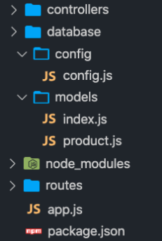

# Desafío

Nuestro cliente estrella IbeiZon, ha solicitado nuestra ayuda para resolver un par de requerimientos técnicos con su base de datos. Nos piden explícitamente que trabajemos con el ORM Sequelize para consultar una serie de datos específicos que están necesitando.

Para esto, asumiendo que ellos ya tienen gran parte de su aplicación montada en Express, nos solicitan que les demos una mano creando el primer modelo de Sequelize que represente la tabla productos, la cual posee solamente las siguientes columnas:


- id

- nombre (VARCHAR(200))

- descripcion (TEXT)

- precio (DECIMAL)


Nuestra misión será entonces completar el archivo del modelo llamado product.js que vemos a continuación:

```javascript

module.exports = (sequelize, DataTypes) => {

   let cols =  {
                  id: DataTypes.INTEGER,

                  nombre: DataTypes.STRING(200),

                  descripcion: DataTypes.TEXT,

                  precio: DataTypes.DECIMAL,

               }

   let config =   {
                     timestamps: false,
                     tableName:'productos'
                  }    
   const product = sequelize.define('Product', cols, config);

   return product;
};

```

---

Ahora que logramos crear el primer modelo, llegó la hora de requerirlo en el controlador de productos (productsController.js). 
Tengamos presente que la estructura del proyecto es la siguiente: 



Debemos completar el archivo productsController.js:

```javascript

const db = require('../database/models')

const controller = {
   index: (req, res) => {
      return res.send('Listado de productos');
   }
}

module.exports = controller;

```

---

Venimos bastante bien, ahora ha llegado el momento de hacer la consulta de TODOS los productos existentes en la base de datos.
Teniendo en cuenta que el controlador (productsController.js) está ya casi preparado, nuestra misión será hacer la consulta respectiva dentro del método index() del controlador y haciendo uso del método send() enviar los datos obtenidos como respuesta del servidor.
Recordemos que el modelo se llama Product.
Debemos completar el archivo productsController.js:

```javascript

const db = require('../database/models');

const controller = {
   index: (req, res) => {
      db.Product.findAll()
      .then((resultados) => {
            res.send(resultados)
      })
   }
}

module.exports = controller;

```
---

Ahora nuestro cliente nos solicita buscar un producto a partir de su id, teniendo en cuenta que el id buscado viajará en la ruta así: /productos/3. Lo anterior significa que deberemos entonces mostrar solo la información del producto con id 3.
Debemos completar el código faltante en el archivo productsController.js:

```javascript

const db = require('../database/models');

const controller = {
  index: (req, res) => {
      db.Product
         .findAll()
         .then(products => {
               return res.send(products);
         })
         .catch(err => {
               return res.send(err)
         })
  },

  porId: (req, res) => {
      db.Product.findByPk(req.params.id)
         .then(products => {
               return res.send(products);
         })
         .catch(err => {
               return res.send(err)
         })
   }
}

```

---

Para finalizar, nuestro cliente —bastante satisfecho— nos solicita un reporte sencillo. 
Quiere consultar todos los productos en la base de datos que tengan un precio mayor o igual a 50000, ordenar los resultados por nombre de manera ascendente y limitar la búsqueda a los primeros 10.

Debemos completar el código faltante en el archivo productsController.js:

```javascript

const db = require('../database/models');
const Op = db.Sequelize.Op;

const controller = {
  index: (req, res) => {
      db.Product
         .findAll()
         .then(productos => {
               res.send(productos);
         })
         .catch(err => {
               res.send(err)
         })
  },

  porId: (req, res) => {
      db.Product
         .findByPk(req.params.id)
         .then(producto => {
               res.send(producto);
         })
         .catch(err => {
               res.send(err)
         })
  },

  porPrecio: (req, res) => {
      db.Product
         .findAll({
            where:{
                  precio: { [Op.gte]: 50000 }
            },
            order:[['nombre','ASC']],
            limit: 10
         })
         .then(producto => {
               res.send(producto);
         })
         .catch(err => {
               res.send(err)
         })
  },
}
 
module.exports = controller;

```